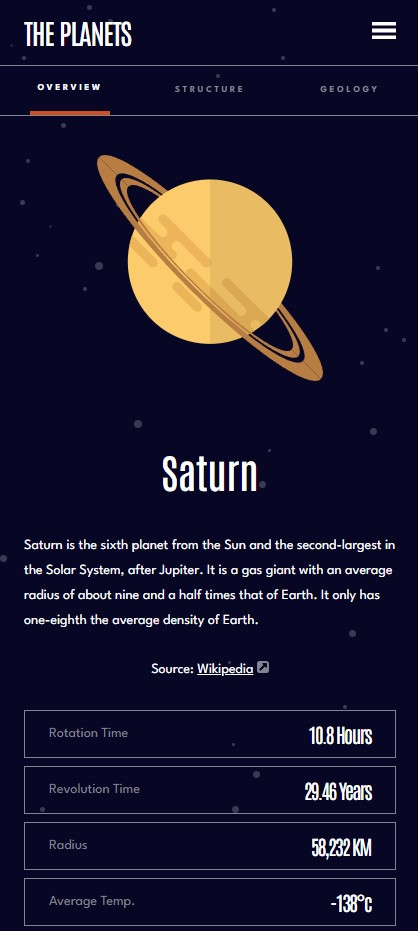

# Frontend Mentor - Planets fact site solution

This is a solution to the [Planets fact site challenge on Frontend Mentor](https://www.frontendmentor.io/challenges/planets-fact-site-gazqN8w_f). Frontend Mentor challenges help you improve your coding skills by building realistic projects.

## Table of contents

- [Overview](#overview)
  - [The challenge](#the-challenge)
  - [Screenshot](#screenshot)
  - [Links](#links)
- [My process](#my-process)
  - [Built with](#built-with)
  - [What I learned](#what-i-learned)
- [Author](#author)

## Overview

### The challenge

Users should be able to:

- View the optimal layout for the app depending on their device's screen size
- See hover states for all interactive elements on the page
- View each planet page and toggle between "Overview", "Internal Structure", and "Surface Geology"

### Screenshot



### Links

- Solution URL: (https://github.com/animalchin45/planetfaqs)
- Live Site URL: (https://planet-faqs.vercel.app/)

## My process

### Built with

- Semantic HTML5 markup
- CSS custom properties
- Flexbox
- CSS Grid
- Mobile-first workflow
- [React](https://reactjs.org/) - JS library

### What I learned

This challenge required me to learn about SVG importing and dynamically displaying SVG’s that are various sizes. While it is rather straight forward to import individual assets in a React project, this is a more difficult task when you have many assets. This is further compounded when you want to dynamically use said assets. I ended up with a couple of very useful hooks and a reusable SVG component that provided a more elegant solution. The result was much more reusable and easier to implement.

Also, in this project I modified the data.json file to add planet colors and SVG base sizes to aid in dynamically changing theme colors and correctly sizing planet graphics.

<!-- Raster image import hook -->

```js
function importAll(r) {
  let images = {}
  r.keys().map((item) => {
    images[item.replace('./', '')] = r(item)
  })
  return images
}

export const images = importAll(
  require.context('../assets', true, /\.(png|jpe?g|svg)$/)
)
```

<!-- Vector image import hook -->

```js
import { useRef } from 'react'

export default function useDynamicSVGImport(name) {
  const ImportedIconRef = useRef()
  ImportedIconRef.current = name

  return { SvgIcon: ImportedIconRef.current }
}
```

<!-- Vector image component -->

```js
export default function Svg({ name, onCompleted, onError, ...rest }) {
  const { SvgIcon } = useDynamicSVGImport(name)

  if (SvgIcon) {
    return <SvgIcon {...rest} />
  }
  return null
}
```

## Author

- Website - [Tim O'Brien](https://timobrien.dev)
- Frontend Mentor - [@animalchin45](https://www.frontendmentor.io/profile/animalchin45)
